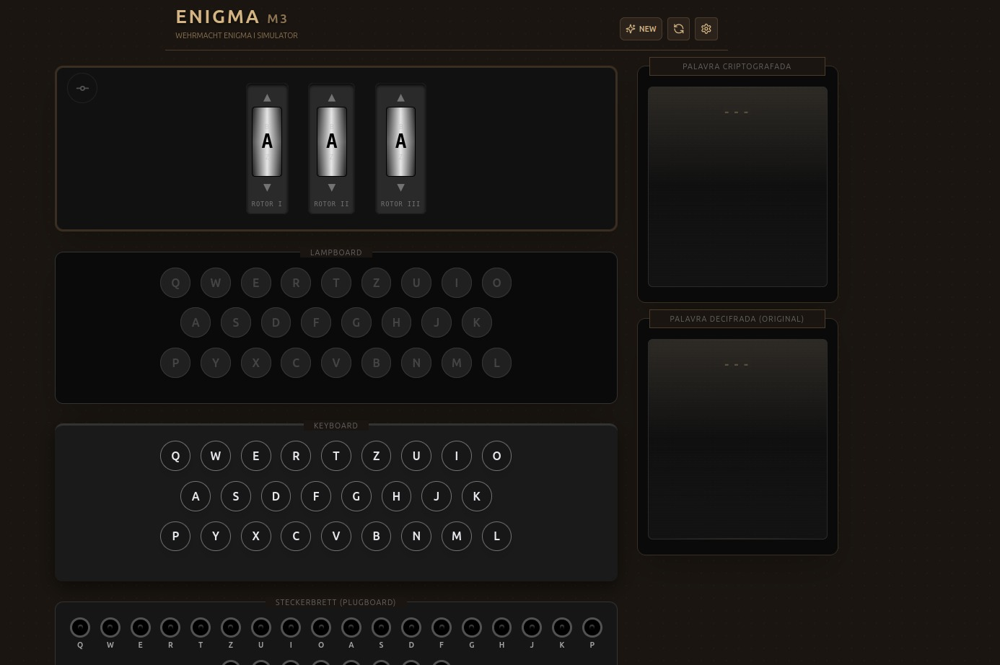
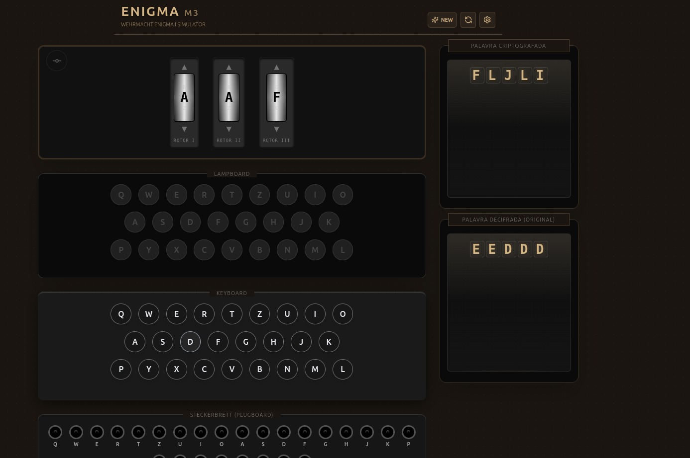
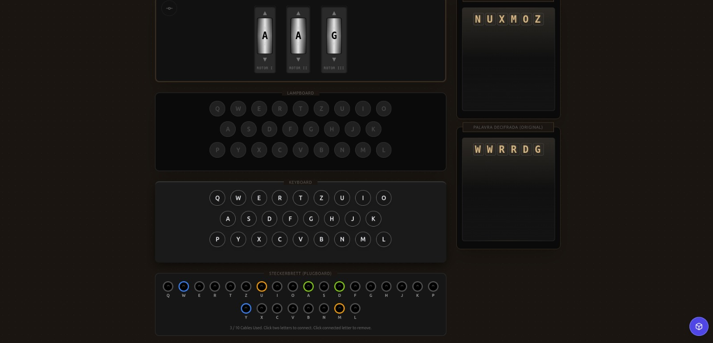
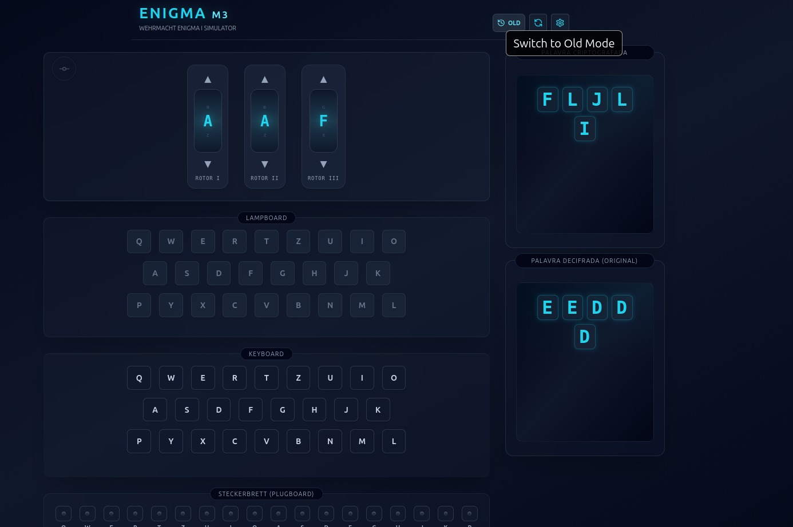
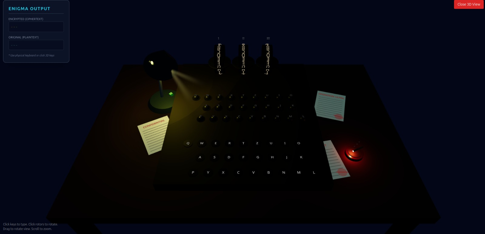

# Enigma Machine

Simulador frontend em React da máquina Enigma M3 usando Vite e Tailwind CSS.

## Pré-requisitos

Antes de começar, certifique-se de ter instalado:

- **Node.js** (versão 16 ou superior)
- **npm** (geralmente vem com o Node.js)

Para verificar se você tem essas ferramentas instaladas, execute no terminal:

```bash
node --version
npm --version
```

## Como Rodar a Aplicação

### 1. Instalar Dependências

Primeiro, você precisa instalar todas as dependências do projeto. No diretório raiz do projeto, execute:

```bash
npm install
```

Este comando irá instalar todas as dependências listadas no `package.json`, incluindo React, Vite, Three.js e outras bibliotecas necessárias.

### 2. Executar em Modo de Desenvolvimento

Após instalar as dependências, inicie o servidor de desenvolvimento:

```bash
npm run dev
```

O Vite irá iniciar um servidor de desenvolvimento local. Você verá uma mensagem no terminal indicando a URL local (geralmente `http://localhost:5173`).

### 3. Acessar a Aplicação

Abra seu navegador e acesse a URL exibida no terminal (geralmente `http://localhost:5173`). Você verá a interface da máquina Enigma.

## Como Usar a Aplicação

- **Configurações**: Use o ícone de engrenagem para escolher os rotores e o refletor
- **Plugboard**: Clique nos soquetes para fazer conexões no plugboard
- **Criptografar/Descriptografar**: Digite no teclado ou clique nas teclas na tela para criptografar ou descriptografar texto

## Interface (Screenshots)

- Tela inicial com visão 3D da mesa e da Enigma.
- Lampada de mesa interativa que liga/desliga a iluminação da cena.
- Rotação dos rotores e teclas/lâmpadas reagindo à digitação.
- Documentos e objetos em 3D compondo o ambiente.







## Fluxo da Aplicação

O fluxo de funcionamento da aplicação segue o processo histórico da máquina Enigma M3:

1. **Inicialização**: A aplicação inicializa a máquina Enigma com os componentes configurados (rotores, refletor e plugboard) através do hook `useEnigmaMachine`.

2. **Entrada do Usuário**: Quando o usuário pressiona uma tecla (física ou virtual), o caractere é capturado e convertido para maiúscula.

3. **Rotação dos Rotores**: Antes de processar cada caractere, os rotores são rotacionados seguindo a mecânica da Enigma:
   - O rotor direito sempre avança uma posição
   - O rotor do meio avança quando o rotor direito está no entalhe (notch)
   - O rotor esquerdo avança quando o rotor do meio está no entalhe

4. **Processamento do Sinal**: O caractere passa pelo seguinte caminho de criptografia:
   - **Plugboard** (entrada): Troca de letras conforme as conexões configuradas
   - **Rotores (ida)**: Passa pelos três rotores da direita para a esquerda
   - **Refletor**: Reflete o sinal de volta
   - **Rotores (volta)**: Passa pelos três rotores da esquerda para a direita
   - **Plugboard** (saída): Aplica novamente as trocas do plugboard

5. **Saída Visual**: O caractere criptografado é exibido:
   - Na lâmpada correspondente (que acende momentaneamente)
   - No campo de texto de saída (texto criptografado)
   - No campo de texto de entrada (texto original digitado)

6. **Atualização de Estado**: As posições dos rotores são atualizadas após cada criptografia, mantendo o estado da máquina sincronizado.

A aplicação também oferece duas visualizações: uma interface 2D tradicional e uma visualização 3D interativa, ambas utilizando a mesma lógica de criptografia.

## Scripts Disponíveis

- `npm run dev` - Inicia o servidor de desenvolvimento
- `npm run build` - Cria uma versão otimizada para produção
- `npm run preview` - Visualiza a versão de produção localmente (execute após `npm run build`)

